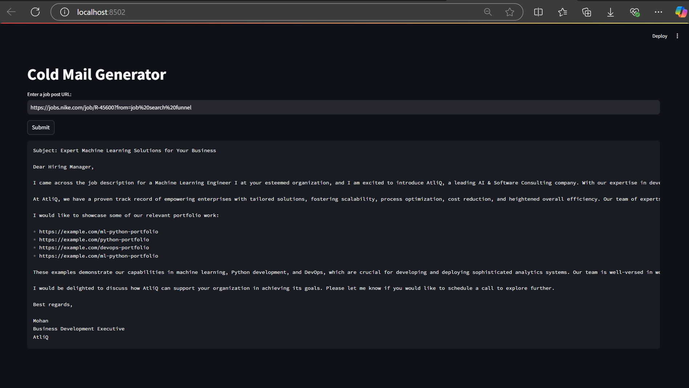

# 📧 Cold Email Generator using LangChain and Google Generative AI

## 🧾 Overview

An AI-powered Cold Email Generator that automates the creation of personalized cold emails using **LangChain** and **Google Generative AI**. The app extracts job descriptions from web pages, processes them, and generates customized emails based on user input.

---

## 🚀 Features

- ✅ **Personalized Email Generation**  
  Automatically generates cold emails tailored to job descriptions.

- 🌐 **Web Interface**  
  Built with **Streamlit** for easy and interactive user experience.

- 🔍 **Job Description Extraction**  
  Extracts and processes job postings from the web or pasted text.

- 🧠 **Advanced AI Integration**  
  Uses **LangChain** for chaining tasks and integrates **Google Generative AI** for high-quality content.

- 🔐 **Secure API Management**  
  Utilizes **dotenv** to securely manage sensitive API keys and configurations.

---

## 🛠️ Technologies Used

- **Python** – Core programming language  
- **Streamlit** – Framework for building the web UI  
- **LangChain** – For LLM chaining and integration  
- **Google Generative AI** – For generating customized email content  
- **ChromaDB** – For storing and querying portfolio/job data  
- **Pandas** – For data manipulation  
- **dotenv** – For secure environment variable handling

---

## ⚙️ Setup Instructions

### 1. Clone the Repository

```bash
git clone https://github.com/tinku3666/Cold-Email-Generator.git
cd Cold-Email-Generator
```

### 2. Install Dependencies

```bash
pip install -r requirements.txt
```

**Sample `requirements.txt`:**
```
streamlit
langchain
google-generativeai
chromadb
pandas
python-dotenv
```

---

### 3. Set Up Environment Variables

Create a `.env` file in the root directory using the provided `.env.template`:

#### 📄 .env.template
```
GOOGLE_API_KEY=your_google_api_key_here
```

Rename the file to `.env` after filling in your actual key:

```bash
cp .env.template .env
```

> 🔐 **Important:** Never upload your `.env` file to version control (it should be in `.gitignore`).

---

### 4. Run the Application

```bash
streamlit run main.py
```

Your application will be available at: [http://localhost:8501](http://localhost:8501)

---

## ☁️ Deployment

### ✅ Deploy on Streamlit Cloud

1. Push your code to a GitHub repository.
2. Visit [https://share.streamlit.io](https://share.streamlit.io)
3. Paste your repo link and select `main.py` as the entry point.
4. Add your `GOOGLE_API_KEY` in the **Secrets** tab on the Streamlit dashboard.

### ✅ Deploy on Render

1. Go to [https://render.com](https://render.com) and create an account.
2. Choose **Web Service** and connect your GitHub repo.
3. Set **Start Command** to: `streamlit run main.py`
4. Add the `GOOGLE_API_KEY` as an environment variable in the dashboard.
5. Deploy your app and Render will handle hosting.

---

## 🖼️ Output Screenshot



---

## 🔄 How It Works

1. Users input a job description or URL.
2. The app uses **LangChain** to extract relevant job content.
3. A personalized cold email is generated using **Google Generative AI**.
4. The result is shown in the Streamlit interface for copy/send/customization.

---

## 📬 Contact

- **Name**: Rithvik Reddy  
- **Email**: [rithvikreddy3666@gmail.com](mailto:rithvikreddy3666@gmail.com)
